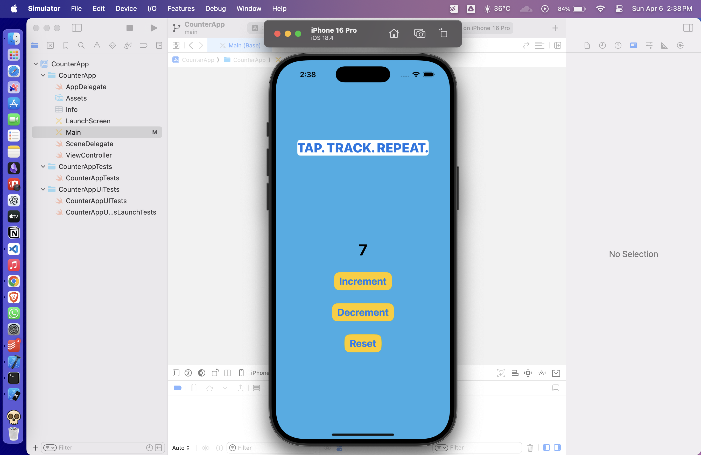
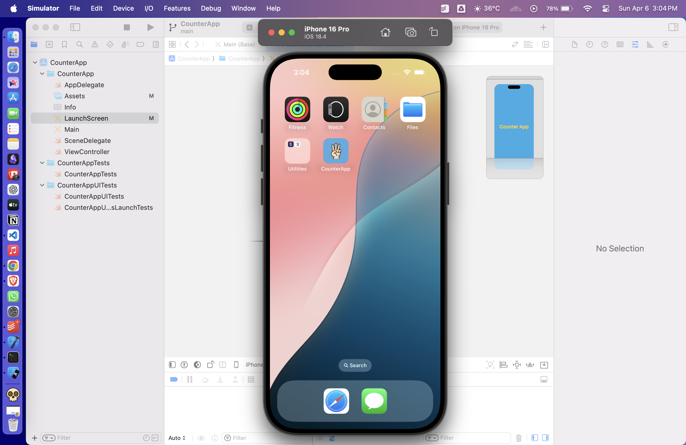

# CounterApp

A simple iOS app built using UIKit and Storyboards that lets users increment a counter by tapping a button.

## Features

- Tap to **increment** the counter
- **Decrement** button to decrease the count
- **Reset** button to start over
- **Saves your count** even after closing the app (using UserDefaults)
- Clean UI built using Storyboard

## Screenshots

## How to Run

1. Clone the repo
2. Open `CounterApp.xcodeproj` in Xcode
3. Build and run on the simulator or a real device

---

Built with ❤️ using Swift and UIKit
